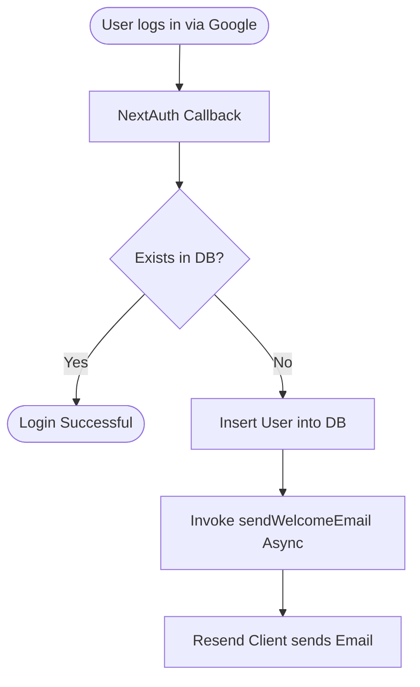

# Resend Email Automation Guide

This document explains the configuration and codebase integration for automatic email notifications using **Resend** in the Synibe application.

---

## 🏗️ Email Automation Architecture

The email automation setup automatically fires a **Welcome Email** to new users who register via Google OAuth. 



---

## ⚙️ Step-by-Step Implementation Guide

### Step 1: Configure Your API Key
Obtain an API key from your [Resend Dashboard](https://resend.com) and add it to your `.env` file:
```env
RESEND_API_KEY=re_your_api_key_here
```

---

### Step 2: Initialize the Resend Client
The Resend client is instantiated in [`lib/resend.ts`](file:///c:/Projects/synibe/lib/resend.ts). 

```typescript
import { Resend } from "resend";

export const resend = new Resend(
  process.env.RESEND_API_KEY
);
```

> [!WARNING]
> **Avoid Top-Level Actions**: Do not execute calls like `await resend.emails.send(...)` directly at the top level of modules. Doing so will force Next.js to trigger the API calls during the `next build` phase when the server-side environment variables might not be set.

---

### Step 3: Implement the Email Template & Send Logic
In [`lib/Email.ts`](file:///c:/Projects/synibe/lib/Email.ts), create the email body layout and execute the delivery request using the initialized `resend` client:

```typescript
import { resend } from "./resend";

export async function sendWelcomeEmail(
  email: string,
  name: string
) {
  await resend.emails.send({
    from: "onboarding@resend.dev", // Default address for free tier/testing
    to: email,
    subject: "Welcome to Synibe 🎉",
    html: `
      <h1>Welcome ${name}!</h1>
      <p>Thanks for joining Synibe.</p>
      <p>Create rooms, sync videos, and watch together.</p>
    `,
  });
}
```

---

### Step 4: Hook into the Authentication Flow
In [`auth.ts`](file:///c:/Projects/synibe/auth.ts), hook the mail automation into NextAuth's `signIn` callback:

1. Import the `sendWelcomeEmail` function.
2. Inside `callbacks.signIn`, query the database for the registering user using **Drizzle ORM**.
3. If the user does not exist, insert them and dispatch `sendWelcomeEmail(user.email, user.name)` asynchronously.

```typescript
import NextAuth from "next-auth"
import Google from "next-auth/providers/google"
import { db } from "./db/drizzle";
import { users } from "./db/schema";
import { eq } from "drizzle-orm";
import { sendWelcomeEmail } from "./lib/Email";

export const { handlers: { GET, POST }, signIn, signOut, auth } = NextAuth({
  providers: [
    Google({
      clientId: process.env.AUTH_GOOGLE_ID!,
      clientSecret: process.env.AUTH_GOOGLE_SECRET!,
    }),
  ],
  callbacks: {
    async signIn({ user }) {
      if (!user.email) return false;

      // Check if user exists in the database
      const existingUser = await db.query.users.findFirst({
        where: eq(users.email, user.email),
      });

      if (!existingUser) {
        // Register new user inside the database
        await db.insert(users).values({
          name: user.name || "User",
          email: user.email,
          image: user.image || null,
        });

        // Trigger welcome email notification asynchronously
        sendWelcomeEmail(user.email, user.name || "User");
      }
      return true;
    },
  }
});
```

---

## 🛠️ Verification & Troubleshooting

### 1. Verification Checklist
- [ ] Your `.env` file contains a valid `RESEND_API_KEY`.
- [ ] During local development or Docker deployment, the `RESEND_API_KEY` environment variable is successfully passed down.
- [ ] The sender address (`onboarding@resend.dev`) is used unless you have verified your custom domain in the Resend dashboard.

### 2. Missing API Key Errors during build
If you receive the error `Missing API key. Pass it to the constructor new Resend("re_123")` during build phase:
- Ensure no code calls the Resend SDK at module evaluation time (outside functions).
- Ensure `RESEND_API_KEY` is declared as a build argument in `docker-compose.yml` and `Dockerfile` if Next.js compiles routes using it at build time.
